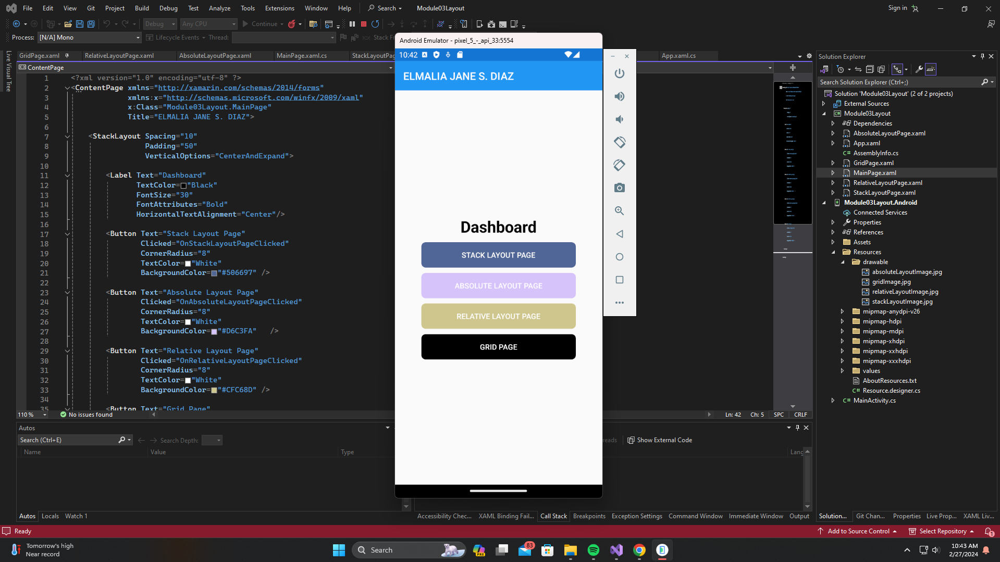
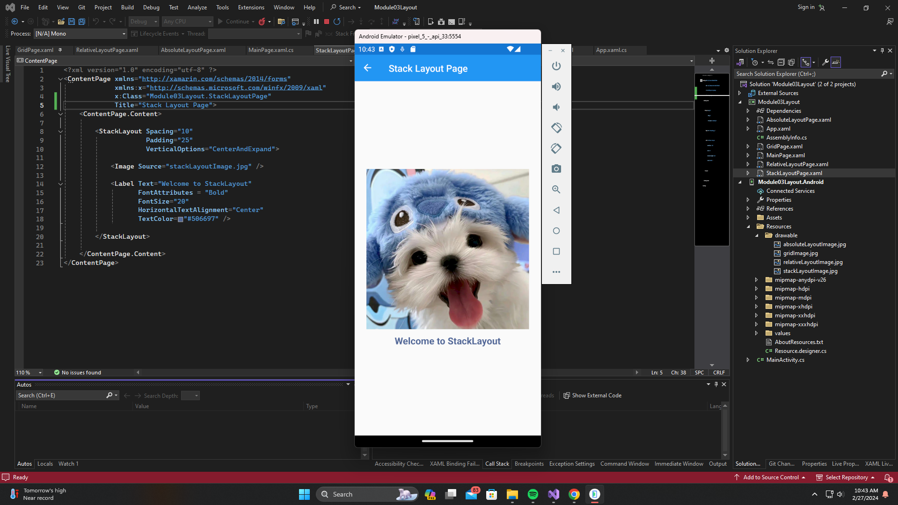
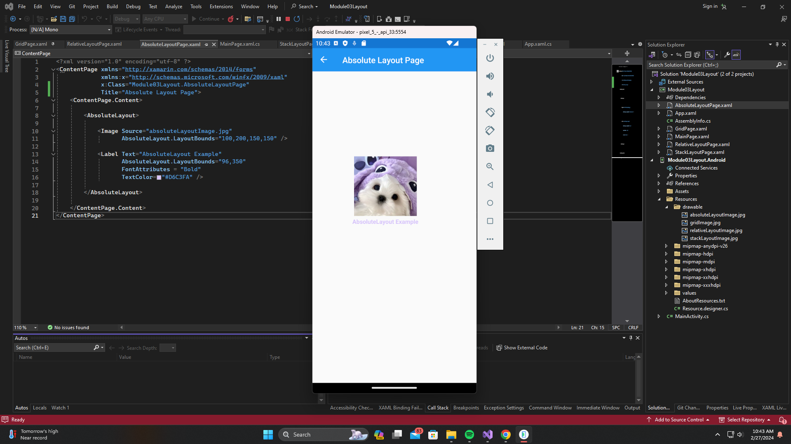
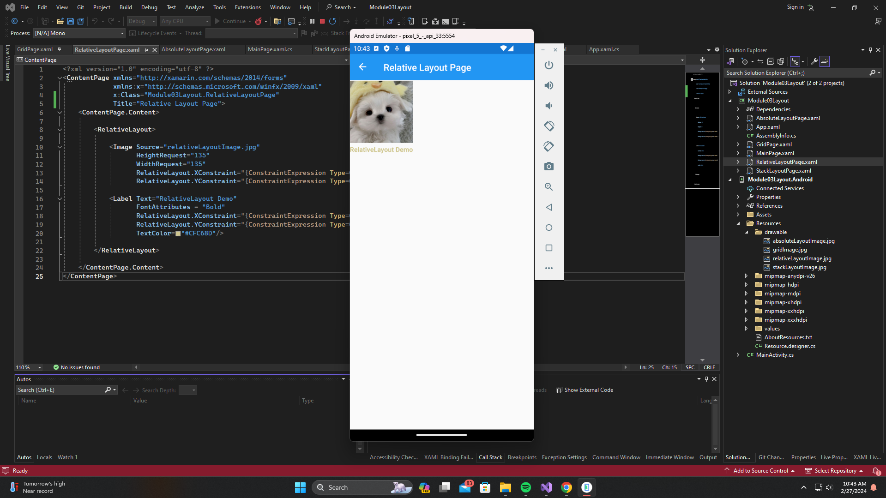
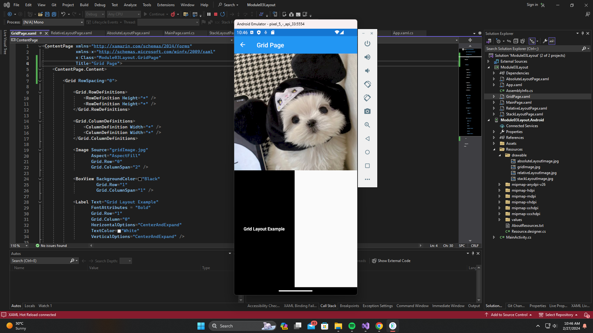

# Module 03 - Exercise 01 (PDC03-LAB)

    Name of Student: Elmalia Jane S. Diaz
    Year and Section: BSIT3A
    Activity Title: Module 03 - Exercise 01
    Date Submitted: February 27, 2024
    
## MainPage/Dashboard
### Source Code
- [MainPage.xaml](Module03Layout/Module03Layout/MainPage.xaml)
- [MainPage.xaml.cs](Module03Layout/Module03Layout/MainPage.xaml.cs)
### Output Screenshot

## StackLayout Page
### Source Code
- [StackLayoutPage.xaml](Module03Layout/Module03Layout/StackLayoutPage.xaml)
### Output Screenshots

## AbsoluteLayout Page
### Source Code
- [AbsoluteLayoutPage.xaml](Module03Layout/Module03Layout/AbsoluteLayoutPage.xaml)
### Output Screenshots

## RelativeLayout Page
### Source Code
- [RelativeLayoutPage.xaml](Module03Layout/Module03Layout/RelativeLayoutPage.xaml)
### Output Screenshots

## Grid Page
### Source Code
- [GridPage.xaml](Module03Layout/Module03Layout/GridPage.xaml)
### Output Screenshots

